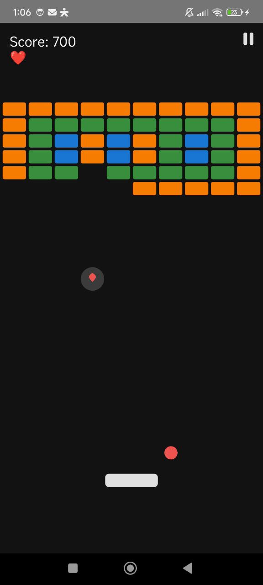

# Kotlinoid

Это классическая игра в жанре "Арканоид", созданная с нуля на языке Kotlin с использованием декларативного UI-фреймворка Jetpack Compose. Проект является демонстрацией реализации игровой логики, управления состояниями, кастомной отрисовки на Canvas и создания простого, но увлекательного игрового процесса.

## Основные возможности

* **10 Уровней с возрастающей сложностью:** Игра содержит 10 уникальных, предопределённых уровней. Сложность повышается за счёт введения более прочных кирпичей и усложнения их расположения.
* **Система "прочных" кирпичей:** Реализованы кирпичи с разным запасом здоровья (HP), которые требуют нескольких ударов для уничтожения. При получении урона кирпич визуально меняется.
* **Разнообразные призы:** Из кирпичей могут выпадать как **бонусы**, так и **анти-бонусы**, добавляя элемент случайности и риска:
    * ✅ **Широкая платформа**
    * ✅ **Дополнительная жизнь**
    * ✅ **Multi-ball** (несколько мячей)
    * ❌ **Узкая платформа** (анти-бонус)
    * ❌ **Ускорение мяча** (анти-бонус)
* **Анимации и эффекты:** Для улучшения игрового опыта ("game feel") добавлены:
    * Анимация "поглощения" приза платформой.
    * Эффект вспышки платформы при подборе приза.
* **Поддержка тёмной темы:** Приложение автоматически адаптирует свою цветовую палитру под системную тему (светлую или тёмную), установленную на устройстве пользователя.
* **Полное управление состоянием игры:** Реализованы все необходимые состояния: готовность к запуску, игра, пауза, прохождение уровня, победа и проигрыш с возможностью перезапуска или выхода.

## Стек технологий

* **Язык:** [Kotlin](https://kotlinlang.org/)
* **UI:** [Jetpack Compose](https://developer.android.com/jetpack/compose)
* **Отрисовка:** `Canvas API` в Jetpack Compose для всего игрового процесса.
* **Среда разработки:** Android Studio

## Как запустить проект

1.  Клонируйте репозиторий на свой компьютер.
2.  Откройте проект в последней версии Android Studio.
3.  Соберите проект и запустите его на эмуляторе или реальном устройстве Android.

## Управление

* **Перемещение платформы:** Проведите пальцем (drag) в нижней части экрана влево или вправо.
* **Запуск мяча / Переход на следующий уровень:** Сделайте однократное нажатие (tap) по экрану.
* **Пауза / Возобновление:** Нажмите на иконку "пауза" / "play" в правом верхнем углу.
* **Чит для тестирования:** Быстрое **пятерное нажатие** во время игры мгновенно завершает текущий уровень.

## Возможные улучшения

* Добавление звуковых эффектов и фоновой музыки.
* Создание таблицы рекордов (High Scores) с сохранением на устройстве.
* Новые типы призов (например, лазеры, замедление мяча, "липкая" платформа).
* Больше уровней и, возможно, боссы в конце каждых 10 уровней.